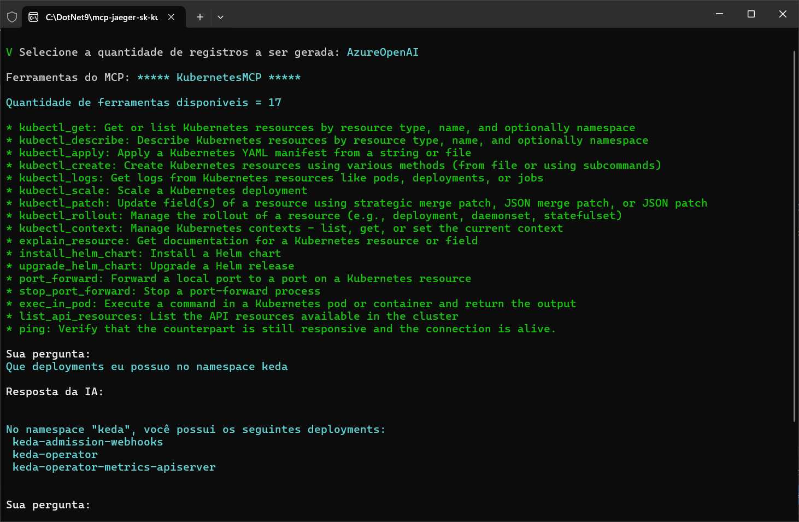
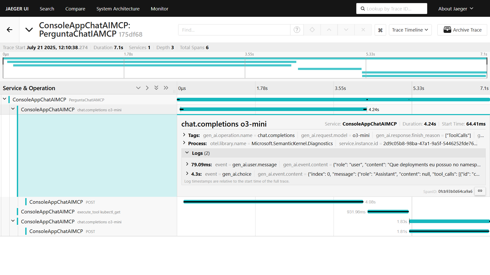

# dotnet9-semantickernel-otel-jaeger-mcp-kubernetes_chat
Exemplo em .NET 9 de Console Application que faz uso do projeto Semantic Kernel, com integração com soluções de IA como Azure Open AI e Ollama na interação com um servidor MCP - utilizei o Kubernetes MCP para testes. Inclui Docker Compose para criação do ambiente de testes com os serviços de monitoramento do Jaeger + OpenTelemetry.

---

## Exemplo de testes com esta aplicação

Ferramentas que integram o MCP + pergunta sobre deployments em um namespace:

Trace gerado neste teste e visualizado a partir do Jaeger:

